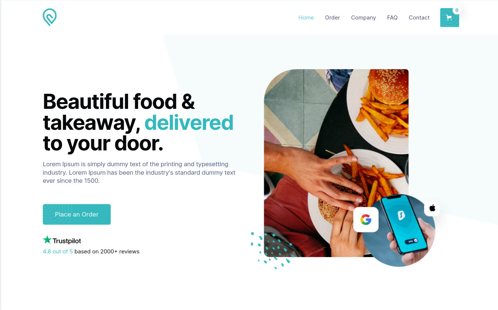

<h1 align="center">
  RipeBites
</h1>
<div align="center">
  
</div>


## 🚨 Forking this repo (please read!)

RipeBites is webapp that allows customers to order food from restaurants, cafes, and other food establishments and have it delivered directly to their doorstep

## Built With

- [Next.js]
- [Tailwindcss]

## 🛠 Installation & Set Up

1. Clone the repo
   ```sh
   git clone https://github.com/rdhss/ripebites.git
   ```
1. change dir
   ```sh
   cd ripebites
   ```
2. Install NPM packages
   ```sh
   npm install
   ```
3. Start the Application
   ```sh
   npm run dev
   ```
